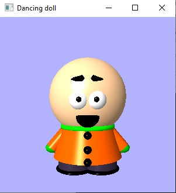
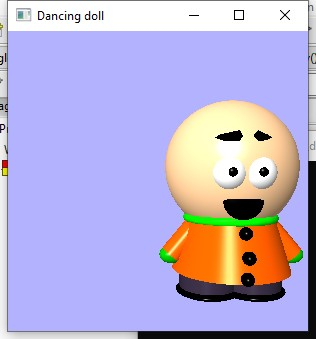
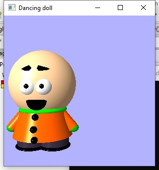
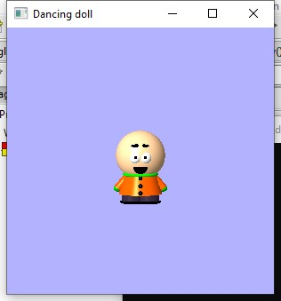

# Moving-doll
A doll moves across the screen using keyboard controls

## Description
This project is built using C++ and glut. It needed multiple functions and openGL libraries. 
This project shows a cute doll with an orange coat. It can move around the window using keyboard controls. 

## Getting Started

### Dependencies
The programs needed to install:-
* Codeblocks - an IDE for C/C++ programming
* FreeGlut - a C library for creating and managing OpenGL window

Both are available for all versions of windows and mac.

### Executing Program:-
* Using 'create new project' from codeblocks, create a GLUT project
* Run the files inside the project

## Preview Of The Project

Front View

Right View

Left View

Far View

## How it works

After hitting run the doll will be displayed in front view. Using right and left arrow keys the doll moves towards right and left of the window. The up and down arrows are used to draw the doll near and far. 

